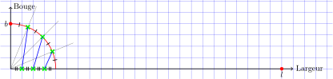
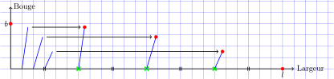
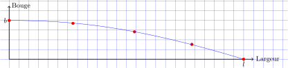

# Courbe de Bezier et feuille de Calcul

## Introduction

Nous regardons ici les courbes paramétriques de Bézier en vue de proposer des outils pour une étude dans une simple feuille de calcul. Les courbes de Bézier sont utilisées pour des modélisations dans de nombreux domaines, du tracé de courbes, jusqu'au CSS en passant par les polices de caractère.

## Un peu de mathématiques

Commencons par l'équation classique des courbes paramétiques de Bezier :


Pour être plus clair, on va expliciter cette formule dans le cas d'un espace à 3 dimensions (x, y, z) sous la forme du produit d'un vecteur (de longueur n+1) calculé en un point t0 et d'une matrice (n+1 lignes - 3 colonnes) qui retourne un vecteur (de longueur 3) ; en utilisant les même notations que précédemment :


Interessons-nous maintenant au vecteur des B et écrivons-le autrement.


Maintenant, en regardant l'équation précédente, si l'on remarque d'une part que :


Et si d'autre part on rajoute :


On obtient :


En considérant que les i sont les colonnes et les k les lignes, la matrice des C est une matrice carré (n+1) triangulaire inférieure. Cette matrice est constante, elle ne dépend que du nombre de points. On peut donc réécrire la formule globale sous la forme d'un produit matriciel (un vecteur (n+1) X une matrice triangulaire inférieure (n+1 - n+1) X une matrice (n+1 - dim) ==> un vecteur (dim)) :


Sur le plan pratique du calcul, on notera qu'il n'est pas nécessaire d'effectuer le double produit matriciel dans tout les cas. La matrice des C ne dépend que du nombre de points de contrôle. Si on effectue des évaluations pour plusieurs t à points de contrôle constants, on peut parfaitement faire préalablement le produit C X P. De même, si pour un ou des t données, on souhaite modifier des coordonées de P, il est possible d'effectuer préalablement le produit du vecteur T par la matrice C.

Pour effectuer le calcul des différentes dérivées en fonction de t, le plus simple consiste à dériver le vecteur des t^k (en k*t^(k-1) pour la dérivée première, k(k-1)*t^(k-2) pour la dérivée seconde, etc...), puis à effectuer le produit matriciel précédent avec ce nouveau vecteur.

## Calcul de la Matrice

Voici un code python3/numpy pour calculer les matrices C selon la formule précédente pour un nombre de points variant de 2 à 11. Ou [Ici](src/calcmat.py)

```python3

  #!/bin/env python3

  '''
    Calcul et affichage de la matrice des coefficients de la courbe de Bezier
  '''

  import math
  import numpy as np

  # generateur équivalent à range(n+1), pratique pour \sum_{i=0}^{n}
  def mathRange(n: int) -> int:
    num: int = 0
    while num <= n:
      yield num
      num += 1

  _nmax = 11 # nombre de points max (n+1)

  for nP1 in range(2, _nmax+1):
    arr: np.ndarray = np.zeros((nP1, nP1), dtype=np.int32)
    n: int = nP1-1
    fn: int = math.factorial(n)
    for i in mathRange(n):
      fi: int = math.factorial(i)
      assert(fn % fi == 0) # normalement évident
      fn_i: int = fn//fi
      for k in mathRange(n):
        if k >= i:
          s: int = (-1)**(k-i)
          fki: int = math.factorial(k-i)
          fnk: int = math.factorial(n-k)
          fd: int = fki*fnk
          assert(fn_i % fd == 0) # moins évident
          arr[k, i]: int = s*(fn_i//fd) # k: ligne, i: colonne
    print(f'pour {nP1} points :')
    print(f'{arr}')
    print()

```

Les différentes matrices :


## Un exemple : le quart de nonante

Le quart de nonante est une technique traditionnelle utilisée par les charpentiers de marine pour tracer la courbure transversale d'un pont de bateau (qui n'est généralement pas plat). Ce tracage est réalisé en grandeur réelle avec une simple règle et un compas sur une demi-largeur. On notera l cette demi-largeur et b le bouge du pont, c'est à dire la hauteur maximum du pont par rapport à l'horizontale.

Etape 1 : on découpe la circonférence d'un quart de cercle de rayon b en quatre parties, ainsi que la partie horizontale du quart de cercle. On trace les segments respectifs en reliant les points horizontaux et les points sur la circonférence, un à un.



Etape 2 : on découpe la demi-largeur l en quatre parties on reporte les segments précédents par translation horizontale sur les points ainsi définis. Les points définitifs, extrémités des segments, sont en rouge.



Etape 3 : le charpentier de marine applique sur les points précédents une latte flexible et effectue un traçage, puis une éventuelle découpe.



C'est à ce point que nous souhaitons remplacer la modélisation "physique" avec une latte par une modélisation avec une courbe de Bézier dans une feuille de calcul. [version LibreOffice](xls/CalculMatricielBezier.ods), [version Excel97-2003](xls/CalculMatricielBezier.xls). La feuille de calcul contient les matrices, un jeu de test, un calcul de points de contrôle dans le cas du quart de nonante, la variante fifth of nonante (découpage en cinq points), la variante sixth of nonante (découpage en six points).

## Bibliographie

1. Les Piegl et Wayne Tiller, *The NURBS Book*, Ed. Springer, 978-3540615453.
2. [A Primer on Bézier Curves](https://pomax.github.io/bezierinfo).

## Remerciements

Merci aux contributeurs de [LaTeX](https://www.latex-project.org/), [dvisvgm](https://dvisvgm.de/).